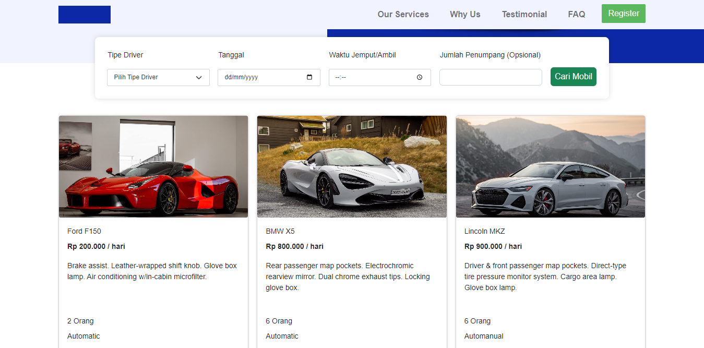
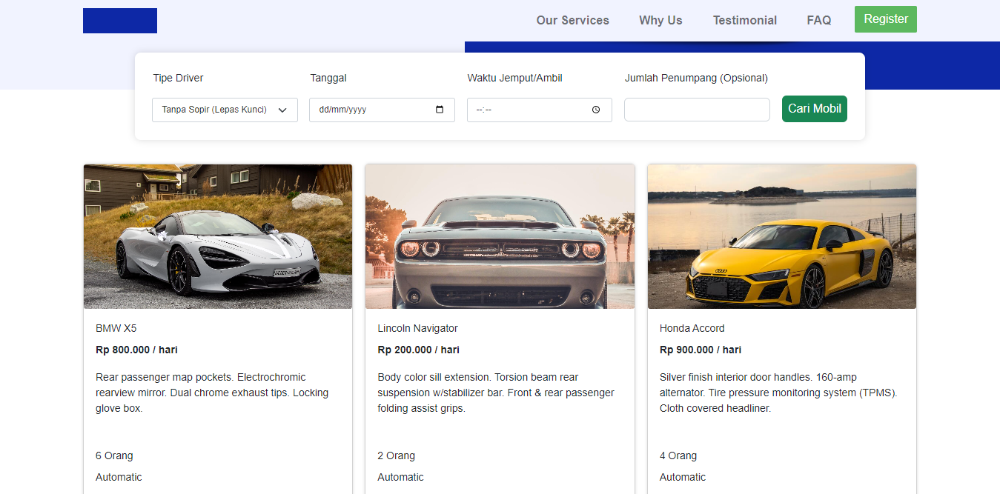
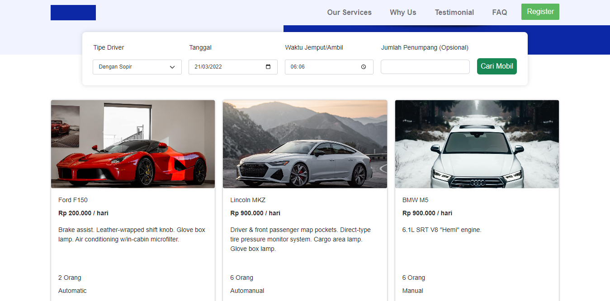
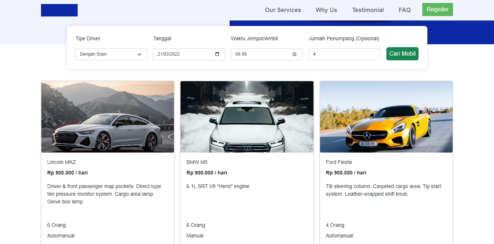

# BCR React

## Spesifikasi Filter Daftar Mobil

- Daftar mobil harus dapat di-filter berdasarkan Tipe Driver
  - Dengan supir
    
  - Lepas Kunci
    
- Daftar mobil harus dapat di-filter berdasarkan Waktu Sewa
  - User akan memasukkan waktu sewa.
  - Pastikan mobil yang ditampilkan adalah, mobil yang dapat disewa di Waktu
  - Sewa yang diinput oleh user. Artinya, Tanggal Tersedianya lebih dari Waktu Sewa.
    
- Daftar mobil harus dapat di-filter berdasarkan Jumlah Penumpang
  - User secara opsional akan memasukkan jumlah penumpang.
  - Pastikan mobil yang ditampilkan adalah, mobil yang memiliki kapasitas jumlah penumpang lebih dari Jumlah Penumpang yang diinput oleh user
    
